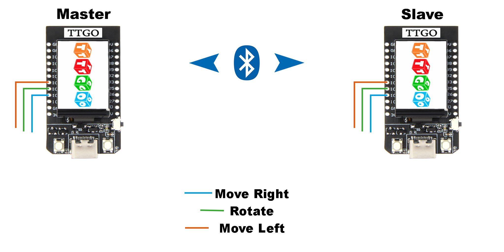

# Classic Bluetooth Tetris

A simple multiplayer tetris game with serial bluetooth communication between two [ESP32](https://www.banggood.com/LILYGO-TTGO-T-Display-ESP32-CP2104-WiFi-bluetooth-Module-1_14-Inch-LCD-Development-Board-For-Arduino-p-1522925.html?rmmds=search&cur_warehouse=CN).

## What I've learned

* Arduino IDE
* TFT library
* BluetoothSerial library

## Schematic

